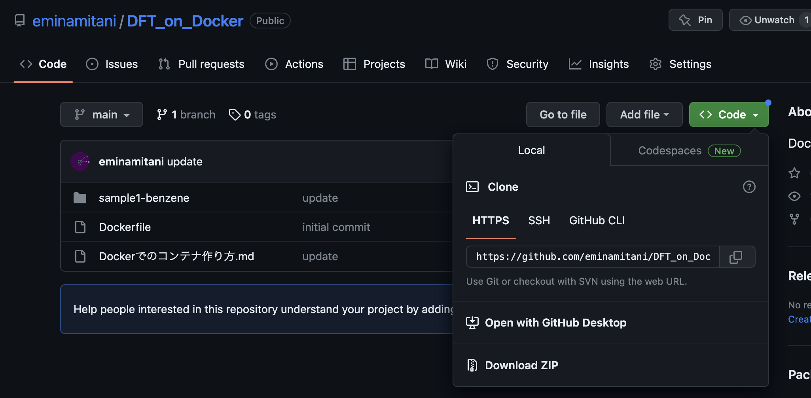

# Dockerを使って第一原理計算をお手軽に試せる仮想環境を作る

第一原理計算をためしたり、そのデータ処理をしたりするのに、一番適しているのはUbuntuに代表されるLinux環境です。
しかし学部生や修士課程で自前のLinux環境を持っている人は少ないでしょう。
そんなときに使えるのが仮想環境です。
WindowsやMacOS上でLinuxの仮想環境を作る方法にはいくつかあるのですが、
慣れてしまえばDockerが手っ取り早いです。

というわけで、今回はDockerを使って仮想環境を作ってみましょう。

## Dockerインストール

### 公式サイト
https://www.docker.com/
ここから、自分のシステムに沿ったものをダウンロードしてインストールします。
Dockerデスクトップを起動すればチュートリアルが始まるので、それが動くか確認しておきましょう。

## 公開鍵暗号
Dockerで立ち上げたコンテナ上であれこれ作業するとき、もちろん
```
docker exec -it hogehoge /bin/bash
```
のように、コンテナのbashをdockerから呼んできて作業もできますが、
ssh(公開鍵暗号)でつないで処理するほうがやりやすいです。SCPでファイル転送もできます。
というわけで、コンテナとやり取りするための公開鍵を作ってきます。
MacOSだと`ssh-keygen`を使うことで秘密鍵（手元においておくほう）
と、公開鍵(.pubの拡張子がついている方)のペアが作成されます。
Windowsの場合はputty-genをインストールしてきて使ってください。
仮想環境なので、パスフレーズはなしで作ります。

Macの場合のコマンドと出力は以下のような風になっています。
```
% ssh-keygen
Generating public/private rsa key pair.
Enter file in which to save the key (/Users/emi/.ssh/id_rsa): id_rsa_container  
Enter passphrase (empty for no passphrase):
Enter same passphrase again:
Your identification has been saved in id_rsa_container
Your public key has been saved in id_rsa_container.pub
The key fingerprint is:
SHA256:YB9+QVP1FFdGxKSSD9xo06AZF5hyYdpW/oSa63qDwnM emi@EminoMacBook-Pro-2.local
The key's randomart image is:
+---[RSA 3072]----+
|          *=*o.*@|
|        .=+X B =o|
|      o oo* @ = .|
|     . + o = B   |
|        S +   o  |
|         . .     |
|     .   ..      |
|      + E.o      |
|       +.o..     |
+----[SHA256]-----+
```
処理は対話式に進んでいくのですが、
`Enter file in which to save the key (/Users/emi/.ssh/id_rsa)`で聞かれた箇所で、
`id_rsa_container `とファイル名を指定しているので  
秘密鍵　`id_rsa_container`  
公開鍵 `id_rsa_container.pub`  
という設定になっています。

この名前の鍵のペアをCLE上においておきますので、
鍵生成がうまく行かない人はそれをダウンロードしてきて試してください。

## DockerFileを使って必要なもの一式が入ったイメージを構築
LinuxベースのOSにはさまざまなものがありますが、
今回はUbuntuというものを使いたいと思います。
Dockerで動くUbuntuのイメージというのも用意されているのですが、
ただ、素のUbuntuのDockerイメージですとコンパイルとかに必要なものが全く入っていないですし、
上述の公開鍵暗号通信のライブラリも入っていないです。

なので、Ubuntuの最新版をベースに必要なものを予め積み込んだイメージを作ります。
このイメージ作成方法を指定したファイルはDockerFileといいます。
Dockerfileはこのリポジトリに置いてあります。
Dockerfileも含め、リポジトリのファイル全体は、
以下のように`Code`の部分をクリックして出てくるDownload　ZIPの部分をクリックすることでダウンロードできます。



## イメージの構築
DockerFileを作業用ディレクトリで、Macの場合はターミナル、Windowsの場合はコマンドプロンプトを開きます。
Dockerは`docker`というコマンドで様々な作業をさせることができます。
まず、-t のオプションでimageの名前を決めてビルドします（いろいろなライブラリが搭載されたUbuntuのベースになるものをつくるということです）。
この例では`ubuntu_ssh`というimageを作成します。

```
docker build . -t ubuntu_ssh
```
できてるかは
```
docker image ls
```
で確認してみましょう。

## コンテナの起動

```
docker run -dit --name ubuntu -p 12222:22 ubuntu_ssh
```
のようにしてコンテナ（仮想環境）を起動します。`-dit`はバックグラウンドで実行＆端末からキーボード入出力を受け取ったりするためのオプション類です。
`-p 12222:22`はコンテナのport 22をホスト（自分のPC）のポート10022に連結することを指しています。
仮想のサーバーのポートを、現実のPCのどのポートに結びつけるかを指定していることになります。
このコマンドで、さっきビルドしたubuntu_sshのイメージに基づいた、コンテナubuntuが起動します。

作ったコンテナに公開鍵暗号でssh接続してみましょう。作成した秘密鍵の名前がid_rsa_containerで、
SSH接続につかうポートは12222に連結されているので
```
ssh root@localhost -p 12222 -i id_rsa_container
```
でssh 接続されます。

いちいちコマンドを書くのが面倒な場合、MacOSであれば
`~/.ssh/config`に
```
Host docker-ubuntu
     HostName localhost
     Port 12222
     User root
     IdentityFile ~/Work/Docker/id_rsa_container
```
のように記載しておけば、
```
ssh docker-ubuntu
```
だけで接続できます。

上の手順で起動したDockerコンテナを停止するには
```
docker stop ubuntu
```

再び起動するには
```
docker start ubuntu
```
のようなコマンドを使います。


## Quantum-Espresso(q-e)のインストール
q-eはgitを使ってダウンロードしてくるのが最も早いので、上記の方法でssh接続した状態で
```
apt install git
```
を行う。

その後、q-e用のディレクトリを作り、そこでgit cloneを行う
```
mkdir q-e
cd q-e
git clone https://github.com/QEF/q-e.git .
```
とする。
これでq-eのソースコードが入手できた。
gitでダウンロードしてきたものは、現在進行系で様々な改良が加えられている(=未報告のバグがあるかも)
なので、安定バージョンになるようにgit でcheckoutする
```
git fetch
git checkout qe-7.2
```
この状態で電子状態計算の部分を担うpw.xをコンパイルしよう

```
./configure
make pw
```

## 電子状態計算を試してみる
quantum-espressoのような平面波基底のコードで最適な系というわけではないのだけれども、感覚がわかりやすいので、単純な分子の計算をしてみようと思う。

ベンゼン分子の計算に使うインプットは以下のようなものだ
```
 &control
    calculation  = 'scf'
    restart_mode = 'from_scratch'
    prefix       = 'benz'
    pseudo_dir   = './'
    outdir       = './'
 /
 &system    
    ibrav     =  1
    celldm(1) = 30
    nat       =  12
    ntyp      =  2
    ecutwfc   = 30.0
    ecutrho   = 240.0
    occupations = 'fixed' 
 /
 &electrons
    diagonalization = 'david'
    mixing_beta     =  0.2 
    conv_thr        =  1.0e-8
 /
ATOMIC_SPECIES
 C   12   C.pbe-rrkjus.UPF
 H    1   H.pbe-rrkjus.UPF
ATOMIC_POSITIONS {bohr}
C     15.628439779     15.000000000  15.00
C     14.309410418     17.284679795  15.00
C     11.671351697     17.284679795  15.00
C     10.352322336     15.000000000  15.00
C     11.671351697     12.715320205  15.00
C     14.309410418     12.715320205  15.00
H     17.675013988     15.000000000  15.00
H     15.333642386     19.057243606  15.00
H     10.647119729     19.057243606  15.00
H      8.305748128     15.000000000  15.00
H     10.647119729     10.942756393  15.00
H     15.333642386     10.942756393  15.00
K_POINTS {gamma}

```

一番最後のブロックはC6H12の分子構造のxyz座標を書いている。
その前の
```
ATOMIC_SPECIES
 C   12   C.pbe-rrkjus.UPF
 H    1   H.pbe-rrkjus.UPF
```
のところの、`C.pbe-rrkjus.UPF`は、計算に使う擬ポテンシャルの種類を指している。

http://pseudopotentials.quantum-espresso.org/legacy_tables
のWebサイトから、各原子のページに飛んで同じ名前のファイルをダウンロードし、
scpでコンテナにファイルを転送する。
SCPはFileZillaやWinSCPのようなファイルクライアントを使うと便利です。
Macなら、ファイルクライアントがない場合でも、
```
scp -i id_rsa_container -P 12222 C.pbe-rrkjus.UPF root@localhost:~/q-e-test/benzen/
```
のようなコマンドで送ることもできます（コンテナ内ではq-e-test/benzenの中で作業している）

作業ディレクトリにインプットファイル(pw.inとしておく)、C.pbe-rrkjus.UPF、H.pbe-rrkjus.UPFの3つが揃ったら

```
~/q-e/bin/pw.x -in pw.in
```
とすると計算が開始される。メモリは1.5GBぐらい消費するので、計算中はPCが重くなるかもしれない。